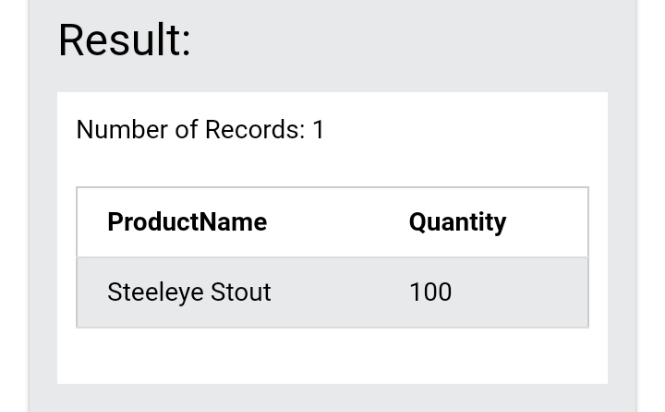

# Datafest-January-Data-Challenge

Using SQL to analyse data and answer the following questions:

#### 1. How many orders were shipped by Speedy Express in total?


#### 2. What is the last name of the employee with the most orders?


#### 3. What product was ordered the most by customers in Germany?




Solutions are contained in the file --> **index.sql**


### Link to dataset [here](https://www.w3schools.com/SQL/TRYSQL.ASP?FILENAME=TRYSQL_SELECT_ALL)
```https://www.w3schools.com/SQL/TRYSQL.ASP?FILENAME=TRYSQL_SELECT_ALL```
